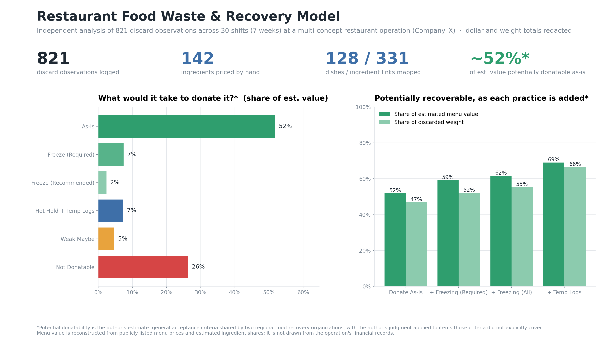
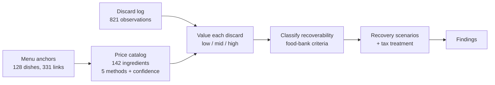
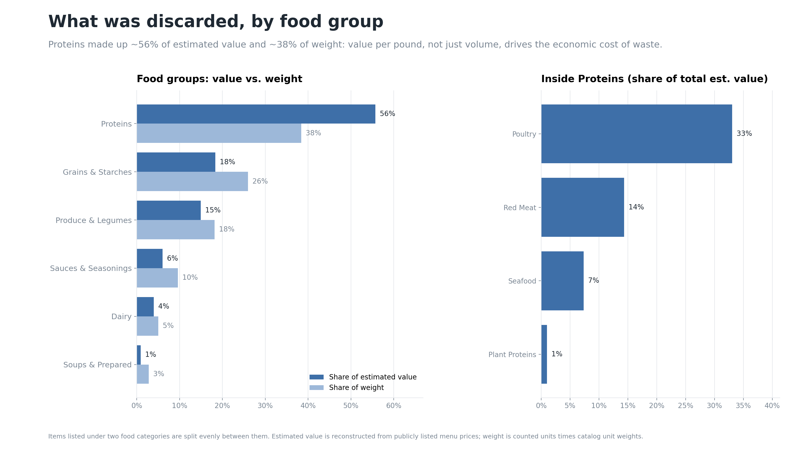
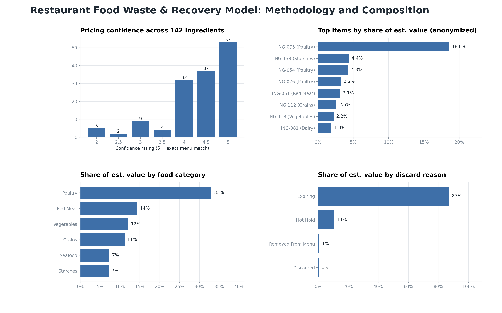

# Restaurant Food Waste & Recovery Model

An independent economics and data-science project that turns hand-collected restaurant discard observations into an estimated economic value, then classifies that food by what it would take to recover it through donation.



| Scale of the work | |
|---|---|
| Discard observations logged by hand | **821** |
| Shifts / observation window | **30 shifts over ~7 weeks** (2025) |
| Distinct items discarded | **140** |
| Ingredients priced individually | **142** |
| Pricing methods | **5**, each documented |
| Price confidence scale | **1–5**, with error bands |
| Dishes mapped / ingredient-to-dish links | **128 / 331** |
| Analysis | Python (pandas, NumPy, matplotlib, openpyxl) |

## Origin

I independently developed this analysis after noticing food-waste patterns while working in restaurant operations at a multi-concept food hall (referred to here as **Company_X**) during its early months of operation. The project was not assigned or commissioned by the company. I identified the question, designed the data collection, built the pricing model, and wrote the analysis on my own.

The question was practical rather than critical: **of the food a kitchen discards, how much could be recovered through donation, and what operational changes would make more of it recoverable?** Early-stage operations naturally carry more waste while demand is still being learned, which makes this a useful window for studying where recovery is possible.

## How it works



### 1. Data collection

Over 30 shifts, I recorded each discarded item: what it was, how many units, why it was discarded (expiring, hot-hold time limit, removed from menu, and so on), whether it could plausibly be donated, and what condition would have to be met first (for example, freezing before expiration or keeping temperature logs during hot holding).

This is messy real-world data, not a classroom dataset. Cleaning it meant handling inconsistent labels, a row with shifted columns, formula cells pasted where values belonged, spelling mismatches between sheets, and totals rows mixed into the data. The pipeline cleans what it can and reports the rest in a data-quality check rather than silently dropping it.

### 2. Data architecture

The workbook has three linked tables plus a documented key:

- **Discard Log:** one row per observation.
- **Price Data:** one row per ingredient, with portion weight, servings per unit, estimated value per serving, confidence rating, operational role, food category, and the dishes it appears in (weighted by how common each dish is).
- **Menu Anchors:** one row per dish, with its listed menu price and how that price divides among its components.

Every ingredient is tagged with an **operational role**: *Core Component* (defines the dish), *Variant Driver* (defines a named variant), *Base/Carrier* (the structural platform), *Support Component* (adds flavor or value, swappable), or *Condiment/Spread*. Roles guide how much of a dish's price an ingredient can reasonably account for.

### 3. Economic valuation

The company's internal costs were not used and are not needed. Instead, each ingredient's value is **reconstructed from publicly listed menu prices** using one of five methods:

| Method | How it works |
|---|---|
| Direct Menu Price | The item is sold on its own; if it appears in several items, a prevalence-weighted average is used |
| Menu Price Minus Known Add-ons | Dish price minus the known prices of its other components |
| Variant Price Comparison | Price difference between variants (e.g., with and without an add-on) |
| Standard Portion Attribution | A consistent share of the dish price, based on its build structure |
| Ingredient Cost Distribution | Manual estimate from the ingredient's role; used sparingly and rated lower confidence |

Each price carries a **confidence rating** from 5 (exact or near-exact match to menu pricing) down to 2 (rough estimate), which sets a low/mid/high error band. Prices were deliberately estimated on the conservative side to avoid inflating results.

The model then enforces **hard caps** so no estimate can exceed what the menu supports: an ingredient's value is capped at its share of the dishes it actually goes into (weighted by how common each dish is), and if a dish's components still add up to more than its menu price, they are scaled down. Food cost is estimated from standard industry cost-of-goods percentages by category.

### 4. Recovery classification

Each discard is sorted by what would make it donatable:

| Tier | Meaning |
|---|---|
| As-Is | Donatable without any change |
| Freeze (Required) | Donatable if frozen before it expires |
| Freeze (Recommended) | Freezing would make it a stronger candidate |
| Hot Hold + Temp Logs | Donatable if hot-holding temperatures are documented |
| Weak Maybe | Borderline |
| Not Donatable | Not recoverable under the criteria used |

**How donatability was determined:** I contacted regional food-recovery organizations and used the general acceptance policies two of them shared. Where those policies did not explicitly cover an item, I applied my own judgment based on similar items. These classifications are therefore my estimates, not confirmations from the organizations.

The model then builds cumulative scenarios, adding one practice at a time, and estimates the tax treatment of donated food inventory under the enhanced deduction in IRC §170(e)(3).

## Findings

All shares below are of the **estimated menu value associated with the observed discarded food**, a model-derived figure reconstructed from public menu prices, not a figure from the company's financial records. Absolute dollar and weight totals are withheld; see [What's public and what's redacted](#whats-public-and-whats-redacted).

- **Recovery potential.** Under the classification criteria above, an estimated **~52%** of that value was potentially donatable as-is, rising to an estimated **~69%** if freezing and temperature-log practices were added.
- **Concentration.** A single item accounted for roughly **19%** of estimated value, and the top five items for roughly **one-third**.
- **Food type.** Proteins made up about **56%** of estimated value but only about **38%** of discarded weight, with poultry alone around **33%** of value. Grains and starches showed the reverse (about 18% of value, 26% of weight). Value per pound, not just volume, drives the economic cost.
- **Cause.** About **87%** of estimated value was discarded for expiring, compared with ~11% for hot-hold time limits, which points to prep quantities and product life as the main levers.
- **Uncertainty.** The confidence bands keep the total estimate within about **−4% / +2%** of its midpoint.

| Figure | Value |
|---|---|
| Estimated menu value associated with observed discarded food | $[REDACTED] |
| Total discarded weight (counted units × catalog unit weights) | [REDACTED] lb |
| Estimated tax benefit under each recovery scenario | $[REDACTED] |





The complete step-by-step output (price-cap checks, every recovery tier and scenario, top 20 items by value and by quantity, food-group and discard-reason breakdowns) is in [`docs/analysis_report.txt`](docs/analysis_report.txt), anonymized and in shares only.

## Implications

The findings point to practical, low-cost opportunities rather than failures. Most of the potentially recoverable value required no change at all, only a donation channel. Freezing items before they expire and documenting hot-hold temperatures are established practices that would make more food eligible. And because waste concentrates in a small number of items, prep calibration on those items is likely the highest-leverage change.

These observations describe conditions during the 2025 observation period only. Kitchen practices change over time, and nothing here describes the operation's current practices or implies any change was made because of this analysis.

## What's public and what's redacted

| Shown publicly | Redacted or anonymized |
|---|---|
| Methodology, code, and data structure | Company name (shown as Company_X) |
| Scale of the dataset (observation, ingredient, dish, and link counts) | Specific dates |
| Percentage shares of estimated value | Menu-item and ingredient names (shown as DISH-### / ING-###) |
| Discard reasons, donation tiers, and conditions | Absolute dollar and weight totals |
| Confidence and category distributions | Location and any store identifiers |

The figures in `docs/figures/` were generated from the real dataset in anonymized, percentage-only mode. The workbook in `data/sample/` is **synthetic**: it has the same structure and formatting as the real one, but names are replaced with IDs, dates and quantities are resampled, and prices are randomly perturbed, so the code can be run without exposing any real data.

## Assumptions and limitations

- **Menu value is an estimate** built from public prices and ingredient-share assumptions; it is reported with confidence bands, not as an exact figure.
- **Donatability is my classification**, based on general food-bank criteria plus judgment, not item-by-item confirmation.
- **Food-cost percentages and the tax rate are illustrative industry assumptions**, not the company's actual costs or tax position. The enhanced deduction only helps a business with taxable income to offset. Nothing here is tax advice.
- **The observation window is about seven weeks** during an early operating period, so it may not represent other seasons or mature operations.

## Run it

```bash
pip install -r requirements.txt
python main.py            # full report, results workbook, and charts on the synthetic sample -> outputs/
python main.py --public   # anonymized, shares-only report and figures -> docs/
```

All assumptions (confidence bands, food-cost percentages, tax rate, interchangeable ingredients) are in `wastemodel/config.py`.

```
main.py                        runs the analysis (private or --public mode)
wastemodel/config.py           every assumption in one place
wastemodel/pipeline.py         load, clean, value, classify, build scenarios
wastemodel/anonymize.py        replaces names with IDs across all sheets
wastemodel/dashboard.py        private and public charts
wastemodel/report.py           step-by-step text report (private or public)
wastemodel/export.py           color-coded Excel results
scripts/make_sample_data.py    builds the synthetic, anonymized sample workbook
data/sample/                   synthetic workbook (safe to share)
docs/                          public figures and analysis report
```
